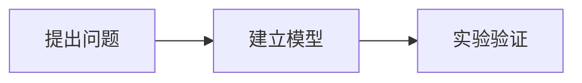

# 个人博客新手操作手册

这份手册写给第一次维护网站的人。你不需要会 Ruby、Jekyll 或前端开发，只需要会打开文件、复制命令和使用 Markdown。

> 最重要的原则：不要在 Windows 中安装 Ruby、Jekyll 或项目依赖。预览和构建都交给 Docker。

## 一、先认识这个博客

平时最常修改的是下面几个位置：

| 想做什么 | 修改位置 |
| --- | --- |
| 修改网站名称、简介、网址、头像 | `_config.yml` |
| 修改“关于”页面 | `_tabs/about.md` |
| 发布或修改文章 | `_posts/` |
| 添加文章图片 | `assets/img/posts/` |
| 更换头像 | `assets/img/avatar/` |
| 修改联系入口 | `_data/contact.yml` |
| 修改 Docker 或部署方式 | 一般不需要；先查看 `README.md` |

以下目录不要手工修改：

- `_site/`：自动生成的网站成品，随时可能被重新生成；
- `.jekyll-cache/`：Jekyll 缓存；
- `.git/`：Git 的内部数据；
- `Gemfile.lock`：依赖版本锁文件，除非升级主题，否则不要手改。

## 二、每次开始修改前

### 1. 打开项目

用 VS Code 打开仓库目录 `F:\Personal Page`。

### 2. 启动 Docker Desktop

等待 Docker Desktop 显示引擎已经运行。

### 3. 启动本地网站

在 VS Code 顶部菜单选择 **终端 → 新建终端**，执行：

```powershell
docker compose up
```

然后访问：

<http://localhost:4000/>

终端保持运行。修改文章后，页面通常会自动刷新；若没有刷新，手动按 `Ctrl+F5`。

停止网站时，在运行 Compose 的终端按 `Ctrl+C`，再执行：

```powershell
docker compose down
```

## 三、修改网站基本信息

打开 `_config.yml`，通常只修改文件上半部分。

### 网站名称与介绍

```yaml
title: RainierGu's Page
tagline: 物理、科研与技术随笔
description: >-
  记录物理课程、科研学习、技术实践与项目进展的个人博客。
```

- `title`：左侧栏的大标题；
- `tagline`：标题下面的小字；
- `description`：搜索引擎和分享链接使用的网站介绍。

### GitHub 用户名与署名

```yaml
github:
  username: RainierGu

social:
  name: RainierGu
  email:
  links:
    - https://github.com/RainierGu
```

不想公开邮箱就让 `email:` 保持为空。不要把密码、Token 或私人邮箱凭据放进这里。

### 网站地址

当前仓库是用户网站，因此配置为：

```yaml
url: "https://rainiergu.github.io"
baseurl: ""
```

这两个值共同组成线上地址：

```text
https://rainiergu.github.io/
```

用户站点不需要路径前缀，因此 `baseurl` 保持空字符串：

```yaml
baseurl: ""
```

### 颜色模式

```yaml
theme_mode:
```

- 留空：跟随访客的系统设置，并允许访客切换；
- `light`：默认浅色；
- `dark`：默认深色。

建议保持为空。

### 修改后为什么没有立即生效

`_config.yml` 不支持热更新。修改后需要停止并重新启动：

```powershell
docker compose restart site
```

## 四、更换头像

当前头像文件是：

```text
assets/img/avatar/avatar.svg
```

最简单的更换方法：

1. 准备一张正方形图片，建议至少 `400 × 400` 像素；
2. 文件名使用英文，例如 `my-avatar.webp`；
3. 把图片复制到 `assets/img/avatar/`；
4. 修改 `_config.yml`：

   ```yaml
   avatar: /assets/img/avatar/my-avatar.webp
   ```

5. 重启网站并刷新浏览器。

推荐 WebP、PNG 或 JPEG。不要上传带有身份证、住址等隐私信息的图片。

## 五、修改“关于”页面

打开 `_tabs/about.md`。顶部 `---` 包围的内容是页面设置，正文写在第二个 `---` 后面：

```markdown
---
title: 关于
icon: fas fa-info-circle
order: 4
---

你好，我是 **你的名字**。

这里可以写研究方向、教育经历、个人兴趣和联系方式。
```

常用 Markdown：

```markdown
# 一级标题
## 二级标题
**粗体**
*斜体*
[链接文字](https://example.com)
- 列表内容
```

不要随意修改 `icon` 和 `order`，否则导航图标或顺序会改变。

## 六、发布一篇新文章

### 1. 创建文章文件

进入 `_posts/`，新建文件：

```text
2026-07-08-my-first-post.md
```

规则：

- 前面必须是 `年-月-日`；
- 后面使用英文小写单词；
- 单词之间用短横线；
- 文件扩展名是 `.md`。

### 2. 复制文章模板

```markdown
---
title: 我的第一篇文章
date: 2026-07-08 20:00:00 +0800
categories: [学习, 物理]
tags: [笔记, 力学]
description: 用一句话介绍这篇文章。
---

## 写作背景

从这里开始写正文。

## 主要内容

- 第一项
- 第二项

## 总结

写下结论和后续计划。
```

注意：

- `date` 不要填写未来时间，否则文章暂时不会显示；
- `categories` 建议不超过两级；
- `tags` 使用简短、稳定的关键词；
- `description` 会显示在首页卡片中。

### 3. 让文章置顶

在顶部设置中添加：

```yaml
pin: true
```

多篇置顶文章按照日期从新到旧排列。

### 4. 给首页卡片添加封面

先把图片放进 `assets/img/posts/`，再添加：

```yaml
image:
  path: /assets/img/posts/my-cover.webp
  alt: 图片内容的简短说明
```

建议封面比例为 `16:9`，例如 `1200 × 675`。`alt` 不能省略，它可以帮助搜索引擎和使用读屏软件的访客理解图片。

## 七、在文章中插入内容

### 图片

```markdown

```

图片统一放在 `assets/img/posts/`，不要直接粘贴 Windows 本地路径。

### 代码

````markdown
```python
def energy(mass, velocity):
    return 0.5 * mass * velocity**2
```
````

三个反引号后面的 `python` 是代码语言，也可以写 `bash`、`javascript`、`cpp` 等。

### 数学公式

文章顶部先添加：

```yaml
math: true
```

行内公式：

```markdown
质能关系为 \(E=mc^2\)。
```

独立公式：

```markdown
$$
F = ma
$$
```

不要使用单美元符号 `$...$` 写行内公式，以免 Markdown 解析混乱。

### Mermaid 流程图

文章顶部添加：

```yaml
mermaid: true
```

正文中写：

````markdown

````

### 表格

```markdown
| 物理量 | 符号 | 单位 |
| --- | --- | --- |
| 质量 | m | kg |
| 速度 | v | m/s |
```

## 八、修改分类、标签和文章

分类和标签页面会根据文章顶部的 `categories` 与 `tags` 自动生成，不需要手工创建。

修改旧文章：

1. 在 `_posts/` 找到对应文件；
2. 修改正文或顶部配置；
3. 保存文件；
4. 查看本地预览；
5. 提交并推送。

删除文章：删除对应 `.md` 文件即可。删除前建议先复制一份到仓库外备份。

## 九、添加或修改导航页面

导航页面位于 `_tabs/`。例如创建“项目”页面：

```text
_tabs/projects.md
```

内容示例：

```markdown
---
title: 项目
icon: fas fa-code
order: 5
---

## 项目名称

项目介绍与 GitHub 链接。
```

`order` 数字越小，导航位置越靠前。图标来自 Font Awesome；如果图标名称错误，页面仍可打开，但图标不会显示。

## 十、修改网页样式时要注意什么

Chirpy 的主题代码安装在容器中，不在仓库里。不要复制或修改完整主题源码。

安全的修改顺序：

1. 先检查 `_config.yml` 是否已有对应设置；
2. 再检查文章顶部配置是否能实现；
3. 确实需要改颜色、间距或字体时，才添加少量自定义 CSS；
4. 每次只改一小部分并立即预览；
5. 同时检查桌面和手机宽度。

不建议新手直接覆盖主题布局文件。这样做可能导致以后升级 Chirpy 时出现大量冲突。

## 十一、发布更新到 GitHub

先确认本地网站显示正常，再执行生产检查：

```powershell
.\scripts\build.ps1
```

看到 `HTML-Proofer finished successfully` 表示页面、图片和内部链接检查通过。

然后提交更新：

```powershell
git status
git add -A
git commit -m "更新博客文章"
git push
```

命令含义：

- `git status`：看看哪些文件被修改；
- `git add -A`：把本次修改放进提交清单；
- `git commit`：在本地保存一个版本；
- `git push`：上传到 GitHub。

如果 `git status` 中出现 `.env`、密码、Token、私人文件或 `_site/`，不要继续提交，先检查 `.gitignore`。

推送到 `main` 后，GitHub Actions 会自动构建网站。可以在仓库的 **Actions** 页面查看进度，通常几分钟内完成。

线上地址：

<https://rainiergu.github.io/>

## 十二、如何判断发布成功

1. 打开 GitHub 仓库；
2. 点击顶部 **Actions**；
3. 找到最新的 **Build and Deploy GitHub Pages**；
4. 绿色对勾表示成功；
5. 打开线上地址，按 `Ctrl+F5` 强制刷新。

如果 Actions 失败，点击失败任务，展开红色步骤查看错误。不要反复修改多个文件；先处理第一条明确错误。

## 十三、常见问题

### `docker` 不是命令

重新打开 PowerShell 或 VS Code。如果仍不行，确认 Docker Desktop 已安装并启动。

### 端口 4000 被占用

先停止旧服务：

```powershell
docker compose down
```

再重新启动。

### 修改 `_config.yml` 后没变化

```powershell
docker compose restart site
```

### 文章没有显示

检查：

- 文件是否放在 `_posts/`；
- 文件名日期格式是否正确；
- `date` 是否是未来时间；
- 顶部两个 `---` 是否完整；
- YAML 缩进是否使用空格而不是 Tab。

### 图片不显示

检查文件名大小写和路径。GitHub Pages 区分大小写：`Photo.webp` 和 `photo.webp` 是两个不同文件。

### 页面有内容但没有样式

当前用户站点必须保持：

```yaml
baseurl: ""
```

### Docker Hub 下载超时

参考 `README.md` 的代理排障章节。代理只在当前终端会话中使用，不要把私人代理或凭据提交到仓库。

## 十四、推荐的日常工作流程

每次更新按照这七步操作：

1. 启动 Docker Desktop；
2. 运行 `docker compose up`；
3. 修改配置、文章或图片；
4. 打开本地网站检查；
5. 运行 `.\scripts\build.ps1`；
6. 使用 Git 提交并推送；
7. 在 GitHub Actions 和线上网站确认结果。

慢一点没有关系。一次只改一类内容，发现问题就更容易定位和恢复。
